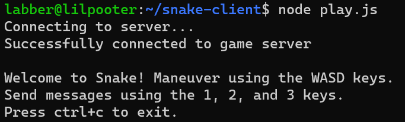

# Snake Client Project

Snake game is a very popular video game. It is a video game concept where the player maneuvers a dot and grows it by ‘eating’ pieces of food. As it moves and eats, it grows and the growing snake becomes an obstacle to smooth maneuvers. The goal is to grow it to become as big as possible without bumping into the side walls, or bumping into itself, upon which it dies.

This is simply a multiplayer take on the genre.

Before you can run this client, you will need to be running the server side which you can obtain [here](https://github.com/lighthouse-labs/snek-multiplayer). 

# Download server & run
Run the following code in your terminal:
~~~
git clone https://github.com/lighthouse-labs/snek-multiplayer.git
cd snek-multiplayer
npm install
npm run play
~~~

## Playing the game

Once you've cloned this repo, run the development snake client using the `node play.js` command. If done correctly, you should see the following:

)